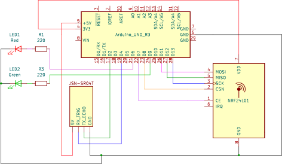
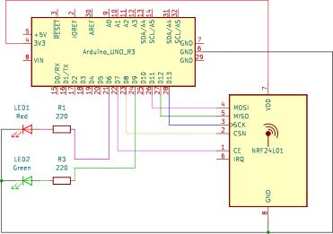
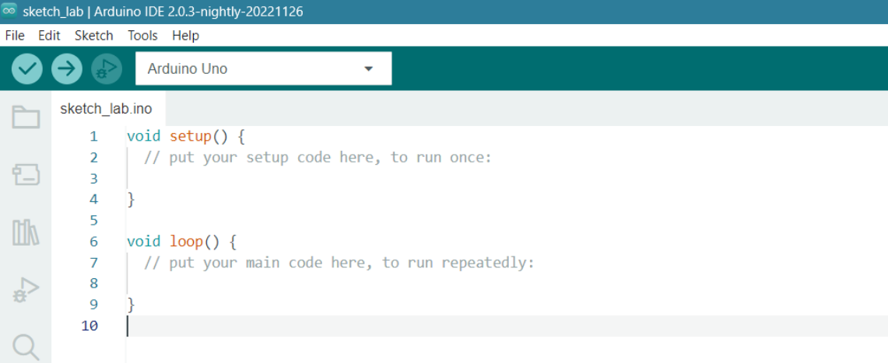
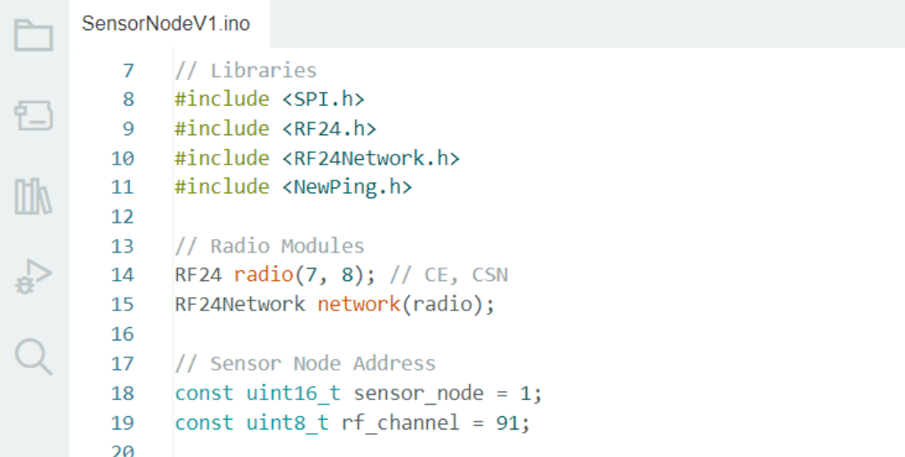
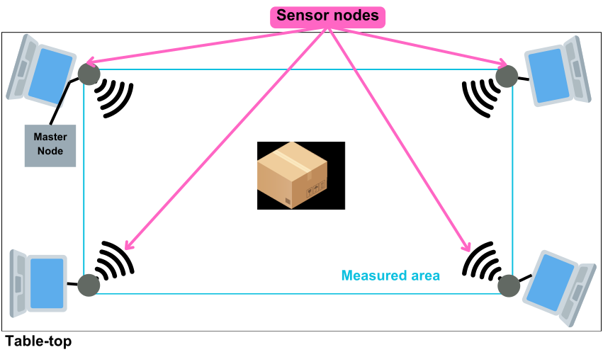

Instituto Superior Técnico, Universidade de Lisboa

**Applications and Computation for the Internet of Things**

# Lab work: Ultrasound Sensor Array Testbed

## Goal:
This work aims to familiarize students with ultrasound sensing technology, with 
background knowledge of the Arduino UNO microcontroller and the wireless radio 
network module. This project will utilize the ultrasound sensor JSN-SR04T, the 
wireless radio module NRF24L01, and components from the Arduino Starter Kit and 
IDE. This project has 2 phases of implementation. In the first implementation phase, 
the students can build a master and slave node system in which the slave will include 
the ultrasound sensor. In the second implementation phase, the students can use 
ultrasound technology to build a localization and testbed system.

## Phase 1

### Description

Build 2 nodes using the Arduino UNO: Master node and slave or sensor node.
- The slave node or sensor node, will include the following:
    - Ultrasound sensor, 
    - JSN SR-04T, 
    - Arduino UNO microcontroller,
    - NRF24L01 wireless radio module,
    - Arduino UNO kit’s Breadboard,
    - 2 color LEDs with the corresponding resistors to indicate the radio 
communication status. 

The following figure represents the assembly diagram of the components in the slave 
node.

- The master node will include:
    - Arduino UNO microcontroller, 
    - NRF24L01 wireless radio module,
    - Arduino UNO kit’s Breadboard,
    - 2 color LEDs with the corresponding resistors to indicate the radio 
communication status. 

The following figure represents the assembly diagram of the components in the master node.

**Objective:** The master node will ask the slave node to execute readings using the 
ultrasound sensor and send the distance measured back. The messages between the 
nodes and the information should be presented on the serial monitor.

### References:
1. JSN SR-04T tutorial - https://www.makerguides.com/jsn-sr04t-arduino-tutorial/
2. NRF24L01 Tutorial - https://howtomechatronics.com/tutorials/arduino/arduino￾wireless-communication-nrf24l01-tutorial/
3. Multiple NRF24L01 Module Network -
https://howtomechatronics.com/tutorials/arduino/how-to-build-an-arduino￾wireless-network-with-multiple-nrf24l01-modules/
4. LED project - https://projecthub.arduino.cc/arduino_world/blink-led-project￾with-arduino-90f185
5. Serial Monitor - https://docs.arduino.cc/software/ide-v2/tutorials/ide-v2-serial￾monitor/

### Recomendations:
- Always ensure that the circuit is disconnected from the power source (either the power 
supply or the PC) when you are working on it. This includes inserting, connecting, or 
disconnecting sensors and actuators.
- Before connecting the circuit to the power source and turning it on, please consult with 
the teacher or the person in charge of the laboratory.
- Verify that all components of the circuit (such as resistors, capacitors) are properly 
connected. This is crucial to prevent short circuits or hardware damage. For instance, 
never connect an LED directly to a terminal of the controller and GND, or VCC.
- Use the Serial Monitor and LEDs to execute debugging to the system
- Try to minimize bending the terminals of the components. If bending is necessary (for 
example, with resistors), ensure that the bend is made approximately 5 mm from the 
body of the component.

### Program the application:
Based on the projects in the References and the description of the system phase, 
create your program for each node, using Arduino IDE. Organize your program in 
“basic blocks” with adequate structures and comments. A basic block is a sequence 
of instructions with no embedded branches (except at end), and no branch targets 
(except at the beginning).

Start by establishing communication between the nodes, including the wireless radio 
module libraries, and defining the node addresses and channels the wireless radio 
network will use to identify each node. The following figure gives an example in how 
to include the wireless radio network libraries and define the node information in this 
network.

Once you have established communication between the nodes, check the JSN SR-
04T tutorial on the References and develop the code necessary to execute readings 
using the ultrasound sensor. The measurements will then be sent to the Master node 
to be presented in the Serial Monitor.

### Results:
1. Using a ruler and the systems created, determine the minimum and maximum 
read by the ultrasound sensor.
2. Using the same object in front of the ultrasound sensor, fix the position of the 
ultrasound probe as the coordinates (0,0,0). Then, vary the ultrasound probe 
coordinates in the x, y and z axes. Construct a table in centimeters with all the 
coordinates, the actual distance (in direct line with the ultrasound probe), and the 
measured distance by the ultrasound sensor. What do you detect when changing 
the z-axis coordinates?
3. Estimate the network latency of the wireless radio network.
4. Study the sound reflection index of the surface of different objects. Describe each 
object, the actual distance of the object, and the distance measured by the 
ultrasound sensor.

## Phase 2

### Description:
The second phase of this project aims for the students to be able to build a localization 
and testbed system using ultrasound technology. 
In this phase, the professor will join four student groups to create the whole testbed 
system. Each student group will operate a slave node, and together, they must create 
the master node with all of the orchestration, calculation functions, and presentation 
of the information reached. 
The localization testbed system will include 1 master node and 4 slave nodes, each 
with a distinct node address and channel. The master node will know these addresses 
and set the channel to communicate with each slave node. The communication 
between the master node and the slaves must be coordinated using a scheduling 
pattern chosen by the students.
The slaves and master nodes will need to be implemented in a rectangular form, like 
the one presented in the following image. 

Each slave node will have coordinates, being one of the nodes with the origin at (0,0) 
and the others with coordinates relative to the origin. The slaves will transmit the 
distance measured to the master node. The master node will collect all the distances
read by each slave, and with a minimum of 3 distances measured, it will calculate the 
coordinates of the target object in the measured area. The students can use the 
trilateration example file in [Trilateration Example](trilateration_example.ino) to calculate the target object's coordinates. Note: 
The trilateration in [Trilateration Example](trilateration_example.ino) only calculates the target object’s (x,y) coordinates; 
the students care free to implement the z-axis coordinates in the calculus.
Finally, with the localization system operational, the students can answer the 
questions in the Results to execute the system as a testbed for the ultrasound array 
of sensing technology.

### References:
1. NRF24L01 Tutorial - https://howtomechatronics.com/tutorials/arduino/arduino￾wireless-communication-nrf24l01-tutorial/
2. Multiple NRF24L01 Module Network -
https://howtomechatronics.com/tutorials/arduino/how-to-build-an-arduino-wireless￾network-with-multiple-nrf24l01-modules/
3. Trilateration - https://ieeexplore.ieee.org/document/7226229

### Recommendations:
- Always ensure that the circuit is disconnected from the power source (either the power 
supply or the PC) when you are working on it. This includes inserting, connecting, or 
disconnecting sensors and actuators.
- Before connecting the circuit to the power source and turning it on, please consult with 
the teacher or the person in charge of the laboratory.
- Verify that all components of the circuit (such as resistors, capacitors) are properly 
connected. This is crucial to prevent short circuits or hardware damage. For instance, 
never connect an LED directly to a terminal of the controller and GND, or VCC.
- Use the Serial Monitor and LEDs to execute debugging to the system
- Try to minimize bending the terminals of the components. If bending is necessary (for 
example, with resistors), ensure that the bend is made approximately 5 mm from the 
body of the component.

### Requirements:
1. The master node communicates with each slave node by its address and 
channel and obtains the distances read by the slave node.
2. The master node calculates the correct coordinates of the target object
    - First, define a control scenario for the system. The control scenario is 
the hypothetical configurations of the system that design the normal 
execution of its functionalities.
    - Analyze different “ultrasound coverage” areas and the target object 
coordinates when inserted in those.
        - Draw a diagram of the measured area where it’s possible to 
analyze the different intersection areas of the ultrasound sensor 
signals,
        - Create a table with the ultrasound signal intersection area number 
(e.g., area #1 – 2 ultrasound signals intersect), the correct 
coordinates of the target object, and the coordinates reported by 
the system.
    - Study the sound interferences to the system for both scenarios, register 
the coordinates of the target object and interferences to the distance 
measurements.
        - First, analyze the system without any noise,
        - Use a smartphone and induce different sound frequencies into 
the system, you can use the following video link on Youtube: 
https://www.youtube.com/watch?v=qNf9nzvnd1k
    - Experiment with different target objects, dimensions, and surface 
compositions.
        - Create a table with the type of object, the dimensions of the target, 
the correct coordinates in the system, and the coordinates 
generated by the algorithm.

### Results:
For each requirement, explain:
- The implemented procedure and thoughts that lead to the implementation,
- The relevant code with explanations and artifacts,
- Possible problems and limitations to the development of the task,
- Analyzed results and conclusions.

----

Created By: Letícia Melo

Inspired By: Applications and Computation for the Internet of Things Laboratory Projects by Prof. Dr. Alberto Manuel Ramos da Cunha
